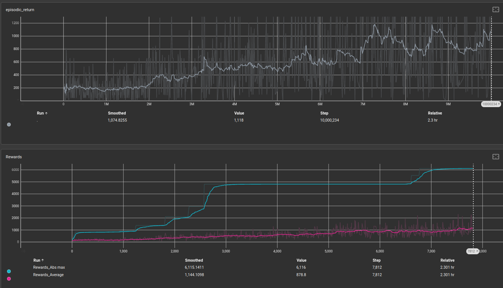
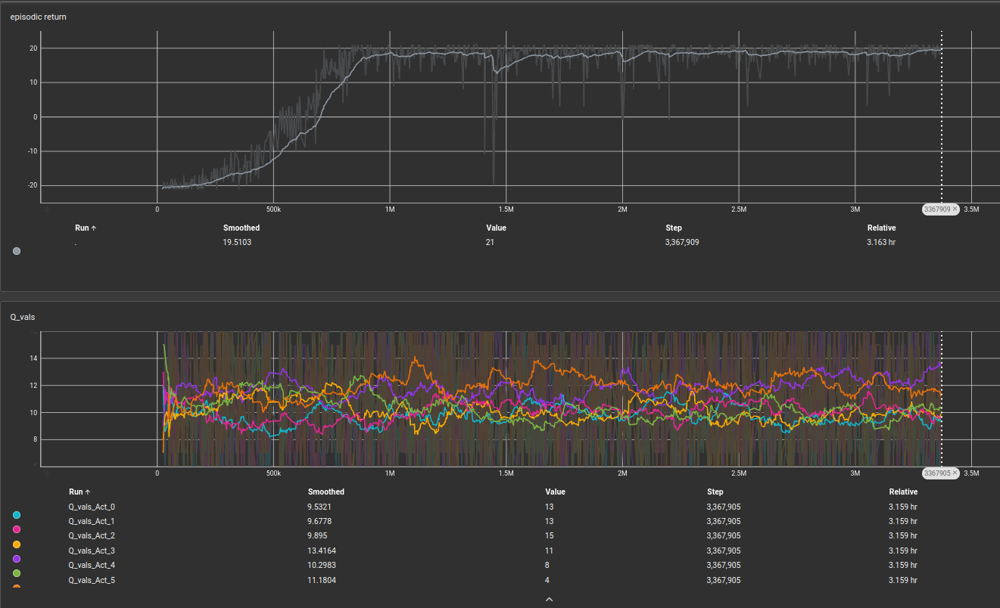
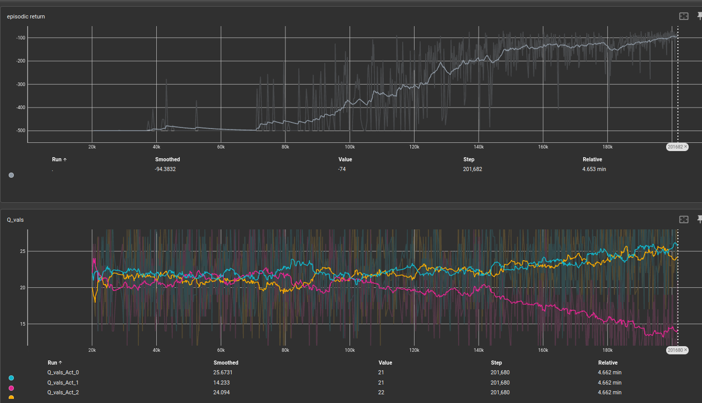

# Reinforcement Learning Algorithms

## Overview
This repository provides implementations of various reinforcement learning (RL) algorithms, including:
- **Proximal Policy Optimization (PPO)**
- **Vanilla Policy Gradient (VPG)**
- **Deep Q-Network (DQN) and its variants: DDQN, N-step DQN, PER**

The implementation supports:
- **Atari** and **Classic Control** environments
- **Continuous and Discrete Action Spaces** (for PPO and VPG)
- **PyTorch-based Deep Learning Models**
- **`gymnasium` instead of `gym`**
- Custom function and class design, distinct from OpenAI Baselines

## Installation
### Prerequisites
Ensure you have Python 3.8+ installed. Then, install the dependencies:

```bash
pip install -r requirements.txt
```

### Cloning the Repository
```bash
git clone https://github.com/mmarouen/agentic-ai-system
cd agentic-ai-system
```

## Usage

### Training an Agent
To train an agent with PPO, run:
```bash
python pg_train.py --algorithm ppo --map-name CartPole-v1
```
For VPG:
```bash
python pg_train.py --algorithm vpg --map-name LunarLander-v2
```
For DQN:
```bash
python dqn_train.py --algorithm dqn --map-name PongNoFrameskip-v4
```
Training will store training results (tensorboard, config files, model files) under the `runs` subfolder named `map-name-exp-name` argument.
Example:
```bash
python pg_train.py --algorithm ppo --map-name CartPole-v1 --exp-name test-run
```
will create the folder `CartPole-v1-test-run` under `runs`


### Hyperparameter Configuration
Pass hyperparameters as command-line arguments:
```bash
python pg_train.py --algorithm ppo --map-name CartPole-v1 --lr-policy 0.0003 --gamma 0.97 --shared-network False
```

### Play
To use the trained agent with PPO or VPG run:
```bash
python pg_play.py --folder ppo-test --map-name CartPole-v1
```
For VPG:
```bash
python pg_train.py --algorithm vpg --map-name LunarLander-v2
```
For DQN:
```bash
python dqn_train.py --algorithm dqn --map-name PongNoFrameskip-v4
```


## Results
Below are reward curves for selected games and algorithms:

### PPO on ALE/BeamRider-v5


### DQN on PongNoFrameskip-v4


### DQN on Acrobot-v1


Additional results are available in the [`results/`](./results/) folder.

Additional results are available in the results/ folder.
## Features
✅ Custom RL framework based on `gymnasium` and PyTorch  
✅ Supports both discrete and continuous action spaces (PPO & VPG)  
✅ Modular and extensible design for easy customization  
✅ Supports Atari and Classic Control environments  
✅ Implements multiple flavors of DQN (DQN, Double DQN, Dueling DQN, etc.)  

## Contributing
Contributions are welcome! Please submit a pull request or open an issue to discuss improvements.

## License
This project is licensed under the MIT License. See the [LICENSE](LICENSE) file for details.

## Contact
Im reachable at my email at azzouz.marouen@gmail.com

